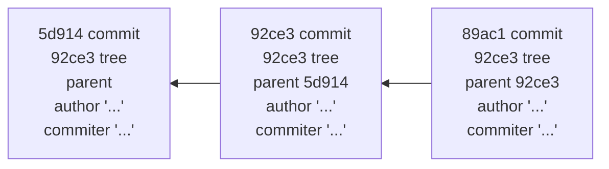

# Ветвление

Если вы сделаете изменения и создадите ещё один коммит, то он будет содержать указатель на предыдущий коммит:


***Ветка*** в git — это перемещаемый указатель на один из таких коммитов. По умолчанию, имя основной ветки в Git — master. Ветка master будет всегда указывать на последний коммит. Каждый раз при создании коммита указатель ветки master будет передвигаться на следующий коммит автоматически.

### Создание новой ветки
При создании ветки создаётся новый указатель для дальнейшего перемещения. Делается это командой:
```
git branch <имя ветки>
```
В результате создаётся новый указатель на текущий коммит.


Специальный указатель `HEAD` указывает текущую локальную ветку. Команда `git branch` только создаёт новую ветку, но не переключает на неё.


### Переключение веток
Для переключения на существующую ветку:
```
git checkout <имя ветки>
```


Таким образом можно создать ветку и, переключившись на нее, поработать, а затем вернулись в основную ветку и поработать в ней. Эти изменения изолированы друг от друга: можно свободно переключаться туда и обратно, а когда понадобится — объединить ветки. Все это делается командами: `branch`, `checkout` и `commit`.

[<<к содержанию<<](./readme.md) | [<назад](./gitobjects.md) | [вперед>]()