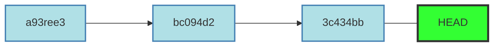

# Операции отмены

Операции отмены - одна из областей Git, где неверными действиями можно ***необратимо*** удалить результаты своей работы, не все операции отмены в свою очередь можно отменить.

### Отмена изменений в файле

Если вы не хотите сохранять свои изменения в еще *не проиндексированном* файле, его можно вернуть к тому состоянию, которое было в последнем коммите. Подсказку дает команда `git status`:
```
$ git status
On branch master
Changes not staged for commit:
Changes not staged for commit:
  (use "git add <file>..." to update what will be committed)
  (use "git restore <file>..." to discard changes in working directory)
	modified:   CONTRIBUTING.md
no changes added to commit (use "git add" and/or "git commit -a")
```
> Use <span style="color:green">"git restore <имя файла>..."</span> to discard changes in working directory.

Важно понимать, чтo `git restore` — опасная команда. Все локальные изменения в файле пропадут — Git просто *заменит его версией из последнего коммита*. Ни в коем случае не используйте эту команду, если вы не уверены, что изменения в файле вам не нужны.

### Отмена индексации файла

Как убрать файл из индекса так же подскажет `git status`:
```
$ git add *
$ git status
On branch master
Changes to be committed:
  (use "git restore --staged <file>..." to unstage)
	modified:   <имя файла>
	renamed:    <имя файла>
```
> Use <span style="color:green">"git restore --staged <имя файла>..."</span> to unstage.

Индексацию отменяет команда: 
```
git restore --staged <имя файла>
```
### Отмена коммитов

Чтобы отменить коммит, необходимо сделать коммит, который удаляет изменения, сохраненные нежелательным коммитом. Необходимо использовать:
```
git revert HEAD
```
`HEAD` – это указатель на коммит в репозитории, который станет родителем следующего коммита. Каждый раз, когда создается новый коммит в репозиторий, HEAD смещается и указывает на него.

Откроется редактор, где можно отредактировать коммит-сообщение по умолчанию или оставить все как есть.
Добавление опции `git revert HEAD --no-edit` необходимо для генерации выходных данных без открытия редактора.

Для отмены самого последнего произведенного коммита, можно использовать `HEAD` в качестве аргумента для отмены. Можно отменить любой произвольной коммит в истории, указав его хэш-значение.
```
git revert <hash>
```
Хэши коммитов находятся в [log](./commit.md):
```
git hist
```

[<<к содержанию<<](./readme.md) | [<назад](./commit.md) | [вперед>](./branch.md)