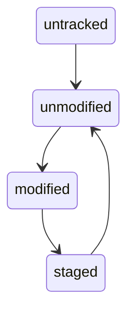

# Состояние файлов

Для просмотра состояния файлов в вашем репозитории используйте:
```
git status
```


Файлы могут быть:

1. Не отслеживаемые (*Untracked*);
2. Отслеживаемые:
    * Не изменены (*Unmodified*),
    * Изменены (*Modified*),
    * Подготовленны (*Staged*).

Файл, который создан и не добавлен в репозиторий, будет в состоянии *untracked*.

Если добавить *untracked* файл в репозиторий, то он переходит в состояние *unmodified*.

Измененный файл, который уже добавлен в репозиторий — находится в состоянии *modified*.

Файл, изменения в котором проиндексированы, попадает в состояние *staged*.

Если делается коммит файла он переходит в состояние *unmodified*.



[<<к содержанию<<](./readme.md) | [<назад](./init.md) | [вперед>]()