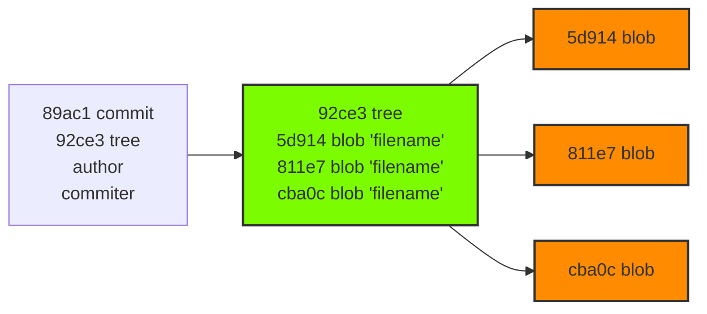

# Объекты git

Всю информацию git представляет в виде *объектов*.

Объекты — это то, в чём git хранит содержимое. Они хранятся в `.git/objects`, директории, которая иногда называется *объектной базой данных*.

Объекты представлены как: *блобы (blobs)*, *деревья(tree)*, *коммиты*.

***Blob*** (binary large object) – большой бинарный объект. Для каждого файла в репозитории формируется blob-файл, который содержит его имя и сжатое содержимое. Blob-файл формируется при добавлении файла в индекс.

Посмотреть информацию о проиндексированных файлах:
```
git ls-files
```
Получить git хэш проиндексированного файла:
```
git ls-files -s <имя файла>
```

***Tree*** (дерево) – показывает связи между файлами в репозитории. Деревья формируются для каждой директории репозитория (в том числе для корневой) во время коммита и показывают, какие файлы (или поддиректории) лежат в данной директории. Таким образом, объект дерева состоит из имен blob-объектов для файлов, которые лежат в данной директории, и других деревьев для всех поддиректорий.

***Объект коммита*** – содержит в себе имя автора коммита, время коммита и объект дерева корневой директории проекта.



Посмотреть тип и содержимое объекта можно при помощи команд:
```
git cat-file -t <hash>
git cat-file -p <hash>
```

[<<к содержанию<<](./readme.md) | [<назад](./cancel.md) | [вперед>](./branch.md)